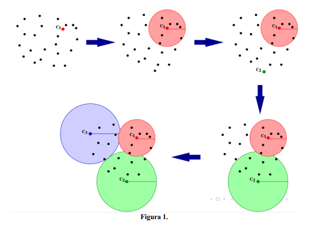
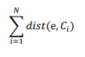

# Clustering-algorithm
This task consists of creating an index, called List of Clusters (LC) using the model of MPI distributed programming. 

This index is used to index multimedia elements, in such a way that process queries efficiently by performing element discarding.

1) The first Cluster Center (C1) corresponds to a database element that is chosen
randomly. For the purposes of this task, C1 will be the first vector in the list that will be provided.
as a database.

2) The K elements closest to C1 are assigned to the first cluster. That is, the first cluster remains
formed by the element C1 plus the K elements closest to it and also by the coverage radius
of the cluster. This radius is equal to the distance between C1 and the furthest element in the cluster.

3) The next cluster center is the DB element farthest from C1, and the same step 2) is repeated
to form the second cluster.

4) From now on, the next cluster center will be the element e that gets the value of the sum
elderly:

    

  where Ci is the ith cluster and dist is the distance function between two elements. Step 2) is
  repeated to form the cluster.

5) The algorithm is iterative and stops when there is no more data to store in a cluster.
